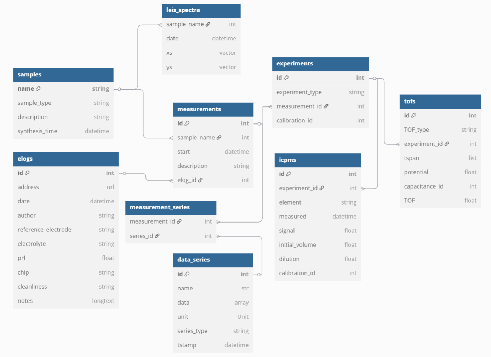

# LowOverpotentialRegime

Data and analysis for:

Soren B. Scott and Reshma R. Rao, Choongman Moon, Jakob Ejler Sørensen, Jakob Kibsgaard, Yang Shao-Horn, and Ib Chorkendorff. **The low overpotential regime of acidic water oxidation part I: The importance of O2 detection**. [Energy & Environmental Science. **2022**, 15, 1977-1987.](https://doi.org/10.1039/D1EE03914H)

and

Soren B. Scott, Jakob Ejler Sørensen,  Reshma R. Rao, Choongman Moon, Jakob Kibsgaard, Yang Shao-Horn, and Ib Chorkendorff. **The low overpotential regime of acidic water oxidation part II: Trends in metal and oxygen stability numbers**.  [Energy & Environmental Science, **2022**, 15, 1988-2001](https://doi.org/10.1039/D1EE03915F)

## Setup

1. Clone or download the repository

2. Install `ixdat` version 0.2.2 or above using::

     pip install --upgrade ixdat


3. Add the folder "src" in this repository to your python path. This will let you import
   from src/pyOER. pyOER is a package that builds on top of ixdat to manage and analyze the
   data in this project.

4. To enable full analysis, download the raw data using this dropbox link:
   https://www.dropbox.com/sh/u0ttselmhd08ntq/AAA43jVl42MB--sV5pyf_6CPa?dl=0

   The size is 3 GB.

   a. By default, the code will look for raw data in **LowOverpotentialRegime/data_raw/**.
      If you download the data to another location, you must create the file **src/pyOER/settings.py**
      and in it, define the `DATA_DIR` variable. An example `settings.py`:
      ```
      from pathlib import Path

      # Change below path to match the path to the shared folder of your project.
      DATA_DIR = Path(r"C:\DATA\other_peoples_data\LowOverpotentialRegime")
      ```

5. If you have any problems, questions, or comments, please contact us! Log an [Issue](https://github.com/ixdat/LowOverpotentialRegime/issues) or write to sbscott@ic.ac.uk


# Figures

## [Part I: The importance of O2 detection](https://doi.org/10.1039/D1EE03914H>)

### Figure 1

(a), (b), and (c) are diagrams. 

(d) and (e):

https://github.com/ixdat/LowOverpotentialRegime/blob/main/figures/part_I_main_figs/part_I_fig1.py

Requires downloading the raw data files.

These panels compare working electrode current and oxygen production during cyclic voltammatry on RuOx. 

Note also that we added annotations to most figures in Inkscape after making the panels with these scripts.

### Figure 2

(a), (b), (c), and (d):

https://github.com/ixdat/LowOverpotentialRegime/blob/main/figures/part_I_main_figs/part_I_fig2.py

(a), (b), and (d) show plots of activity measurements. (c) shows an analysis of the Faradaic Efficiency during the activity measurement in (b).

Requires downloading the raw data files.

### Figure 3

https://github.com/ixdat/LowOverpotentialRegime/blob/main/figures/part_I_main_figs/part_I_fig3.py

This script defines a function `plot_all_activity_results` which is imported by fig5.py amoung others. 
This function is used to make a figure in the lower part (under `if __name__ == "__main__"`

Does not require downloading the raw data, as it uses the results stored in the tables of the repository.

### Figure 4

This was made in Origin. Contact R. R. R.

### Figure 5

https://github.com/ixdat/LowOverpotentialRegime/blob/main/figures/part_I_main_figs/part_I_fig5.py

In addition to making the figure (using an import from fig3.py, this script also solves the model described in [the ESI](https://www.rsc.org/suppdata/d1/ee/d1ee03914h/d1ee03914h1.pdf) for j0, dG1 and dG2.

Does not require downloading the raw data, as it uses the results stored in the tables of the repository.

### Figure S1

On its way.

### Figure S2

https://github.com/ixdat/LowOverpotentialRegime/blob/main/figures/part_I_SI_figs/part_I_figS2.py

Requires downloading the raw data files.

### Figure S3

On its way.

### Figure S4

Made in Origin

### Figure S5

Made in Origin

### Figure S6

Made in Origin

## Figure S7

Made in Origin

### Figure S8

https://github.com/ixdat/LowOverpotentialRegime/blob/main/figures/part_I_SI_figs/part_I_figS8.py

Does not require downloading the raw data, as it uses the results stored in the tables of the repository.

## [Part II: Trends in metal and oxygen stability numbers](https://doi.org/10.1039/D1EE03915F)


### Figure 1

This is a diagram made with Inkscape.

### Figure 2

(a) is a diagram.

(b):

https://github.com/ixdat/LowOverpotentialRegime/blob/main/figures/part_II_main_figs/part_II_fig2.py

Requires downloading the raw data files.

### Figure 3

https://github.com/ixdat/LowOverpotentialRegime/blob/main/figures/part_II_main_figs/part_II_fig3.py

Requires downloading the raw data files.

### Figure 4

https://github.com/ixdat/LowOverpotentialRegime/blob/main/figures/part_II_main_figs/part_II_fig4.py

Does not require downloading the raw data, as it uses the results stored in the tables of the repository.

### Figure 5

https://github.com/ixdat/LowOverpotentialRegime/blob/main/figures/part_II_main_figs/part_II_fig5.py

This uses the plotting function from Figures 3 and 5 of Paper 1.

Does not require downloading the raw data, as it uses the results stored in the tables of the repository.

### Figure 6

https://github.com/ixdat/LowOverpotentialRegime/blob/main/figures/part_II_main_figs/part_II_fig6.py

### Figure 7

This is a diagram.

### Figure S1

This is a diagram.

### Figure S2

On its way.

### Figure S3

On its way.

### Figure S4

On its way.

### Figure S5

https://github.com/ixdat/LowOverpotentialRegime/blob/main/figures/part_II_SI_figs/part_II_figS5.py

# The rest of the repository

## Database

The relational database is represented in tables/ . Each subfolder of table/ acts as a database table, with
each .json file acts as a row. The .json files can be opened with any text editor (e.g. Notepad) for ease of
use. Each table corresponds to a class in pyOER, and each row corresponds to an object of that class.

The database is approximately represented here:
https://dbdiagram.io/d/25C18_pyOER-67d9952375d75cc8448d0bd1 



The tables include but are not limited to:

- **measurements**. A measurement is a collection of metadata about a single EC, MS or EC-MS measurement.
  It includes a pointer to any notes taken during the measurement (elog table), as well as the raw data file.
  pyOER is lazy in that raw data is not loaded by the measurement object until it is needed, saving RAM.
  A `pyOER.Measurement` can be thought of as a wrapper around an `ixdat.Measurement` object 
  (the classes unfortunately share the same name), and should ideally be incorporated into the latter.

- **icpms**. An row in this table represents a single ICPMS measurement, with the counts and metadata
  including which element was measured, which ICPMS calibration it corresponds to, which measurement the
  electrolyte sample was taken during (measurement table) and when in that measurement.

- **experiments**. An experiment contains the additional metadata needed to do a standard analysis of
  a measurement (measurements table) to extract results such as activity, faradaic efficiency, lattice oxygen evolution rate,
  and dissolution rates. The additional metadata can include references to where in the measurement or elsewhere
  to read the calibration of the O2 signal at m/z=32 and the 16O/18O isotopic ratio in the electrolyte

- **tofs**. A row in this table represents a result, which is a rate of oxygen evolution, lattice oxygen evolution,
  or dissolution. It also includes a capacitance value for normalization to number of sites (thus the name of the
  table, for turn-over frequency). Each row also includes all the metadata used to derive the result - most importantly a pointer
  to the corresponding experiment (experiment table) and the timespan during that experiment for which the rate applies.

- **elog**. A row in this table includes an entry in the electronic lab notebook. They contain metadata and the
  some of the experimenter's thoughts during the measurement, and can be useful if a specific measurement
  seems hard to interpret.

The tables were populated semi-automatically using the scripts in data_processing/

Raw data is at present available only to the authors via a dropbox folder.
It will be made publically available upon publication.


## pyOER

`pyOER` is the python package with tools used to navigate the database and analyze the raw data. 
It includes classes corresponding to each of the tables in the database. 
Data processing and Figure scripts import from this package. 
It can be thought of as an extension of `ixdat`, and a clumsy first attempt at the project-level organization we hope to incorporate into `ixdat`.


## Data Processing

The rows of the tables in the database were generated by data processing scripts. We have not copied those over yet but
left them in the repository that was in use before publication of the manuscripts, which is now made public. See 
the data processing scripts here:
https://github.com/ScottSoren/pyOER20/tree/master/data_processing


